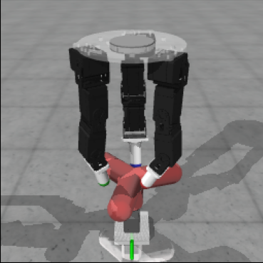
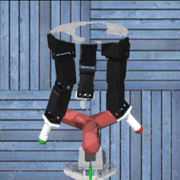
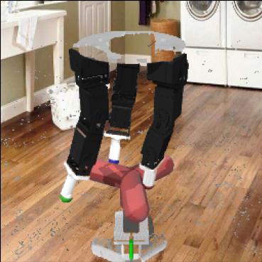

# Invariant Model-Based Imitation Learning using Variational Models (IMAIL)
This is a supplemental experimental result to the accv2022 article.
## Complementary ablation experiments
## D'Claw Experiments
To run practical environments, we use the ROBEL platform, which provides Gym-compliant environments that can be run in both simulation and on real hardware. We train an IL agent to perform the D'Claw task from a third-person perspective. The goal of the task is to successfully turn a wheel on the floor using a robotic arm.

  
   
  

The one on the right is the D'Claw task's default environment. The second and third environments are expert environments for gathering expert demonstrations. The performance of each approach in testing environments during the training period is depicted in the figure below.

The results show that regardless of the environment in which the robot arm is placed, the proposed method can complete the task and outperform the baselines. It allows agents to focus more on the essence of the task, improving the generality of the imitation
learning algorithm and significantly contributing to its practical application.